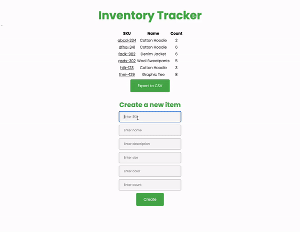
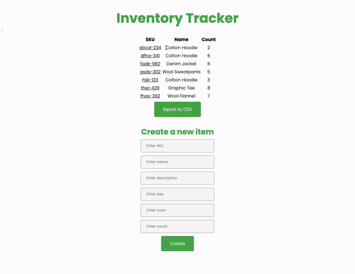

# Shopify-Backend-Developer-Intern-Challenge[^1]
Backend developer challenge for Shopify internship application by Leon Li.

[Click here to try it out!](https://leonli-shopify-backend-challenge.vercel.app/)[^2]

## Introduction
This is my personal take on the challenge to create an inventory tracking web application for a logistics company. This application allows users to keep track of their store inventory by creating, editing, deleting and viewing a list of inventory items.

## Images

## API (Repo link [here](https://github.com/leon-li1/Shopify-Backend-Developer-Intern-Challenge-Server))

To support this web application, I have created an API with 6 routes to support basic CRUD functionality and exporting inventory items to a CSV file.

1. POST /api/item/ \
This route adds an item to your store inventory.

2. GET /api/item/{sku} \
This route retrieves a specific inventory item with the given url path parameter as its sku.

3. PUT /api/item/{sku} \
This route modifies an existing inventory item with the given url path parameter as its sku (400 error if no such item exists).

4. DELETE /api/item/{sku} \
This route deletes an existing inventory item with the given url path parameter as its sku (400 error if no such item exists).

5. GET /api/item/list \
This route lists all inventory items.

6. GET /api/item/export \
This route exports all inventory items into a CSV file.

Click [here](https://inventory-tracker-server.herokuapp.com/docs), to try out the API yourself or to view more API documentation (generated by FastAPI)

## Technologies/Infrastructure
Built with FastAPI (Python3) on the backend and NextJS (TypeScript) on the frontend.
Deployed the backend on Heroku using a PostgreSQL database hosted on AWS and deployed the frontend on Vercel.

[^1]: Click [here](https://docs.google.com/document/d/1z9LZ_kZBUbg-O2MhZVVSqTmvDko5IJWHtuFmIu_Xg1A/edit#) for original challenge link
[^2]: It may take a few seconds for Heroku to start the server up, just refresh and you will be good :)
